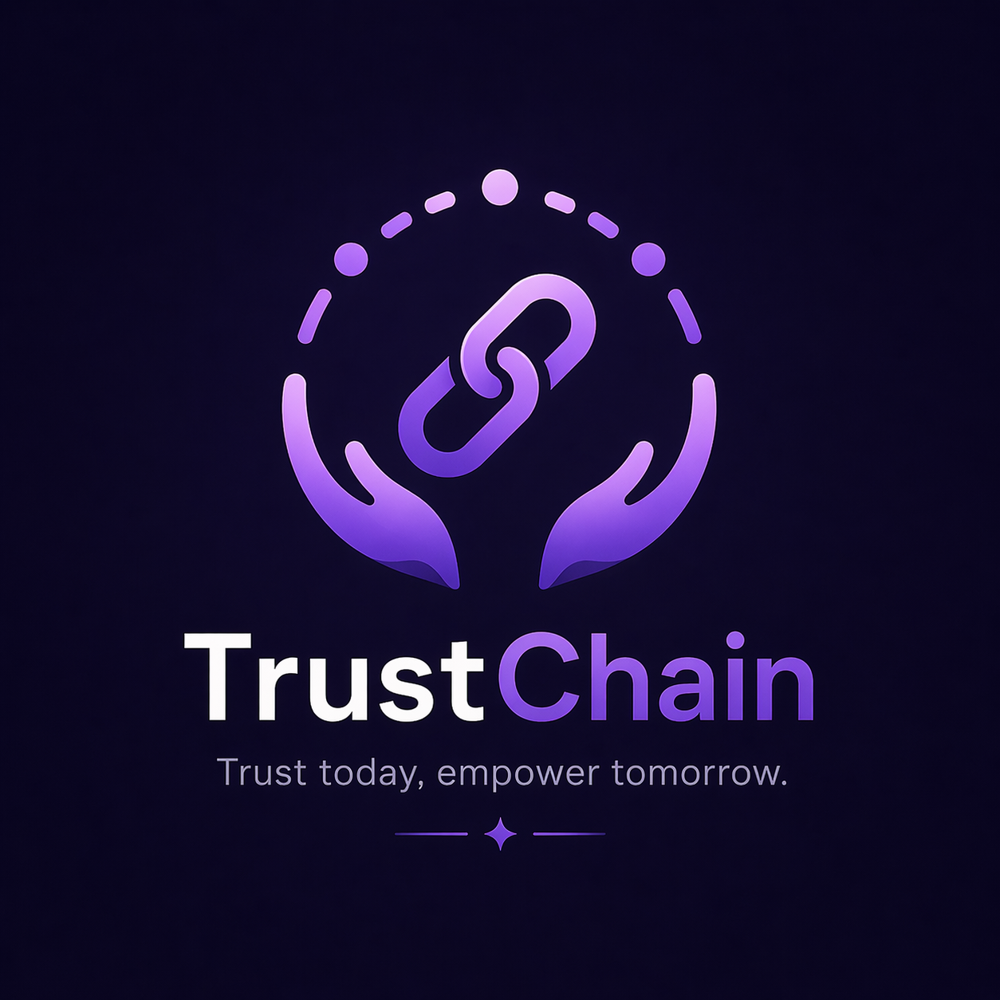

<div align="center">



# TrustChain
### Decentralized Social Credit Network on Stellar Blockchain

*"Trust today, empower tomorrow."*

[](https://github.com/pratickdutta/TrustChain/actions/workflows/ci.yml)
[](https://stellar.expert/explorer/testnet)
[](https://mongodb.com)
[](https://nextjs.org)
[](https://www.typescriptlang.org)
[](https://soroban.stellar.org)
[](https://trustchain-official.vercel.app)
[](https://opensource.org/licenses/MIT)
[](#)
[](https://trustchain-official.vercel.app/metrics)
[](https://trustchain-official.vercel.app/api/health)

<br/>
<h3>🚀 Live Demo: <a href="https://trustchain-official.vercel.app">trustchain-official.vercel.app</a></h3>
<h4>📊 <a href="https://trustchain-official.vercel.app/metrics">Metrics Dashboard</a> &nbsp;|&nbsp; ❤️ <a href="https://trustchain-official.vercel.app/api/health">Health API</a> &nbsp;|&nbsp; 🔐 <a href="./SECURITY.md">Security Checklist</a> &nbsp;|&nbsp; 📖 <a href="./USER_GUIDE.md">User Guide</a></h4>

</div>

---

## Abstract

TrustChain is a decentralized micro-lending protocol built on the Stellar blockchain. It converts social trust and community reputation into a verifiable on-chain credit score, enabling individuals without formal financial history to access liquidity pools.

Rather than requiring collateral, TrustChain uses a Trust Circle attestation graph, where peers vouch for one another to generate a quantifiable TBA (Trust + Behavior + Activity) credit score between 0 and 1000. This score is then used to automatically gate access to micro-loan tiers through smart contract logic.

---

## The Problem

Over 1.4 billion adults globally are unbanked, not because they are untrustworthy, but because they have no paper trail that a traditional institution can verify. They have real-world community reputation, but no mechanism to present it to a lender.

TrustChain solves this by making community reputation cryptographically verifiable and economically actionable.

---

## How It Works

```text
User connects wallet
       │
       ▼
Forms / joins Trust Circles → peers vouch for each other
       │
       ▼
On-chain TBA Credit Score computed (0–1000)
       │
       ▼
Score gates access to Loan Tiers (Bronze → Platinum)
       │
       ▼
Loan requested → Smart Contract auto-approves eligible borrowers
       │
       ▼
Repayment history feeds back into Behavior Score
```

### The TBA Scoring Model

| Component | Weight | Measures |
|-----------|--------|----------|
| **T** — Trust Score | 40% | Peer attestation graph (PageRank-inspired) |
| **B** — Behavior Score | 40% | Loan repayment history |
| **A** — Activity Score | 20% | Wallet age, circle memberships, attestations given |

### Loan Tiers

| Tier | Min Score | Max Amount | Duration |
|------|-----------|------------|----------|
| Bronze | 450 | $50 | 14 days |
| Silver | 600 | $200 | 30 days |
| Gold | 750 | $1,000 | 90 days |
| Platinum | 900 | $5,000 | 180 days |

---

## Architecture

### System Overview

We utilize a modern, decoupled architecture powered natively by Next.js 16 App Router for both client rendering and serverless backend routes, with MongoDB for persistence.

```text
┌─────────────────────────────────────────────────────┐
│                   CLIENT LAYER                       │
│  Next.js 16 (App Router) · TypeScript · Zustand     │
│  Landing · Dashboard · Circles · Loans · Lender     │
└────────────────────────┬────────────────────────────┘
                         │ HTTPS / REST (Bearer JWT)
┌────────────────────────▼────────────────────────────┐
│                    API LAYER                         │
│   Next.js API Routes (Serverless) · Mongoose ORM     │
│  /api/auth  /api/circles  /api/loans  /api/score     │
└────┬──────────────┬──────────────┬──────────────────┘
     │              │              │
┌────▼──────┐ ┌─────▼──────┐ ┌────▼──────────────────┐
│  Auth     │ │  Credit    │ │  Trust Graph Manager  │
│  Service  │ │  Engine    │ │  MoneyPool Manager    │
│  (JWT)    │ │  T·B·A     │ │  MongoDB Database     │
└───────────┘ └────────────┘ └───────────────────────┘
                         │
┌────────────────────────▼────────────────────────────┐
│               STELLAR BLOCKCHAIN LAYER               │
│  Horizon API · Freighter Wallet · XLM · Soroban     │
└─────────────────────────────────────────────────────┘
```

### Authentication Flow

```text
1. User clicks "Connect Wallet" → Freighter browser extension
2. POST /api/auth/challenge { pubKey } → Server issues UUID nonce
3. Freighter signs nonce cryptographically
4. POST /api/auth/verify { pubKey, nonce, signature } → JWT issued (24h)
5. JWT stored in localStorage → Bearer token on all API requests
```

### Smart Contracts (Soroban)

TrustChain relies on three core Rust smart contracts deployed to the Stellar Testnet:

| Contract | Purpose | Testnet Address |
|----------|---------|-----------------|
| **Loan** | Core loan lifecycle, XLM disbursement, and fee collection. | `CCGAK2YJ2WPGE74QTYPXHX5NONQWZMTF6NY2JWHLGDZZC3MYPDBUVWMV` |
| **Score** | On-chain credit score registry for B2B API access. | `CB6P6UZEYJ77DGSLRIGJY4YK4HFMYGQNZAIJQWXYTVZ2A4STSXMIJP2W` |
| **Circle** | On-chain social circle and membership graph anchoring. | `CB4ED6IJTJSSG7WJVL7ZK43EU4NVYL5WT2COT2METRE4FZODSCRM7HE7` |

---

## Features

### Trust Circles & Architecture
- **UCI (Unique Circle Identification)** — Cryptographically unique identifiers ensuring privacy routing.
- **Invite Signatures** — Bypass codes enabling instant private circle joining.
- **Public & Private Visibility** — Stealth controls for communities.
- **Platinum Approvals** — Strict permission gating for high-level operations.
- **MoneyPools** — Convert any Trust Circle into a decentralized lending pool. Members deposit XLM, fund peer loans, and earn a pro-rata share of all interest collected upon dissolution.

### For Borrowers
- **Score Dashboard** — Animated SVG arc gauge showing live T·B·A breakdown.
- **Trust Circles** — Create or join peer groups, vouch for members with a weighted attestation.
- **Liquidity Gateway** — Request micro-loans, view repayment history (including Principal + Interest), track active drawdowns.
- **Leaderboard** — Community-wide credit score ranking.

### For Lenders
- **Lender Gateway** — Register as a lender, set exposure limits, minimum borrower score thresholds.
- **Manual Review Mode** — Toggle between smart contract auto-approval and personal loan review.
- **Portfolio View** — Track active loans you've approved and their repayment status.

### Protocol
- **Hybrid Lending Model** — Pool-to-Peer architecture; lenders deposit into a shared pool and the smart contract auto-approves eligible borrowers.
- **Social Slashing** — Defaults trigger cascading penalties across the defaulter's entire Trust Circle.
- **TRUST Token Burning** — All of a defaulter's TRUST tokens are seized and burned on-chain.
- **Cinematic UI** — Branded intro animations, glassmorphism, and responsive interactions.

---

## Interest & Yield Mechanics

TrustChain is designed to provide fair, risk-adjusted returns to lenders while remaining accessible to borrowers.
- **Risk-Adjusted Rates**: Borrowers in higher Credit Score tiers (e.g., Platinum) receive lower interest rates (as low as 0.5%), while lower-tier borrowers pay slightly more (up to 2%) to offset statistical risk.
- **MoneyPool Dividends**: When a MoneyPool is dissolved, all interest generated by loans funded from that pool is calculated (Total Repaid - Total Lent) and distributed pro-rata to depositors based on their capital contribution.
- **Protocol Fee**: A nominal fee (e.g., 0.20%) is deducted from loan repayments to sustain the TrustChain protocol treasury and fund future ecosystem development.

---

## Default Penalty System

TrustChain enforces accountability without traditional collateral through a **three-layer penalty cascade** that fires automatically on loan default:

| Layer | Who Is Penalized | Penalty |
|-------|-----------------|---------|
| 🔥 **TRUST Token Seizure** | Borrower | Entire TRUST token balance burned to zero |
| 📉 **Score Collapse** | Borrower | BehaviorScore drops **–150 points** (often a full tier downgrade) |
| ⚡ **Social Slashing** | Every attester who vouched for the borrower | –100 TRUST tokens + **–40 BehaviorScore** each |

### Why This Works
Because borrowers' peers are penalized for a default, the **community itself becomes the enforcement mechanism**. Friends, circle members, and vouchers apply real social pressure for repayment — making defaults socially costly, not just financially costly.

---

## Tech Stack

### Frontend
| Technology | Purpose |
|-----------|---------|
| Next.js 16 (App Router) | React framework, routing, SSR |
| TypeScript 5 | Type safety |
| Zustand | Global wallet & auth state |
| Vanilla CSS | Custom dark-mode theme with CSS variables |
| `@stellar/freighter-api` | Freighter wallet browser integration |
| `lucide-react` | Professional icon library |

### Backend
| Technology | Purpose |
|-----------|---------|
| Next.js API Routes | Serverless backend execution |
| MongoDB + Mongoose | Persistent data storage |
| JWT (`jsonwebtoken`) | Stateless session management |
| `@stellar/stellar-sdk` | Horizon API queries |

---

## Getting Started

### Prerequisites
- Node.js 18+
- MongoDB instance (local or Atlas)
- [Freighter Wallet](https://freighter.app) browser extension
- A Stellar Testnet account (fund via [Friendbot](https://friendbot.stellar.org))

### Installation

```bash
# Clone the repository
git clone https://github.com/pratickdutta/TrustChain.git
cd TrustChain

# Install all dependencies (frontend)
cd frontend
npm install

# Start the application
npm run dev
```

Frontend & Next.js API run concurrently at `http://localhost:3000`.

### Environment Variables

Create `frontend/.env.local`:
```env
MONGODB_URI=mongodb://localhost:27017/trustchain
JWT_SECRET=your_jwt_secret_here
STELLAR_NETWORK=testnet
NEXT_PUBLIC_API_URL=/api
NEXT_PUBLIC_ADMIN_PUBKEY=your_stellar_public_key_here
```

---

## 📝 User Validation & MVP Feedback

As part of our real-world MVP validation, TrustChain was tested by 5+ active testnet users. Their feedback was collected and used to drive the first major iteration of the platform.

### 📊 Feedback Collection
* **Google Form**: [View Onboarding Form](https://docs.google.com/forms/d/e/1FAIpQLSdN0PP_iCfX_CbMJoyhpcliIDsVKv3W4oiGPaSkevWCFuxbhg/viewform)
* **Raw Data Analysis**: [View Google Sheet Responses](https://docs.google.com/spreadsheets/d/1pAXSfOcxUEyig12Y8sUc1U0a9Z4jc0ZVf7VUJ9Q4620/edit?usp=sharing)

### 👤 Verified Testnet Users
The following wallets connected to the application and tested the core functionality on the Stellar Testnet:
1. `GC4AJYD7TPXJETE2VEXFRE3ZHIUE6PUX3MYCDBXJH4QNSXZGMDRMCVTI`
2. `GCQRND3J66CHUBQBTSYDPSQUD6NPSEZ32PLJTAZGESNJAFEF6NJII2R3`
3. `GAMX7AYLKU7XOJ6NBCWTSY3W5OSSOBS332M55UG2J5TH5NPCAY545QCM`
4. `GAKH2QXR6TUERN6JHRXGT6AW625X4PESSFWPON5CRQ6A2UFPRDMAAZ2F`
5. `GBBXQ4Y2XSEBBFXYAE76RCW6HQX54BGTO5H7SDMGN3XN77YA7AZ34HY3`

### 🚀 Future Evolution & Iteration 1
Based on the collected feedback, users highlighted that the loan booking flow and transaction confirmations could be clearer for users new to crypto, explicitly requesting visual transaction progress indicators, clear interest rate displays, and potentially a real-time chat system. In our next phase, we plan to evolve the project by exploring an in-app real-time communication layer between lenders and borrowers.

**Completed Iteration:** We have already implemented our first major UI/UX improvement based on this feedback cohort. We built a clear "How to Borrow" step-by-step guide on the Loan Dashboard, explicitly clarified the "Rate of Interest" on the loan terms, and engineered a multi-step visual Transaction Status Indicator that guides users through the smart contract execution and wallet signing.
* **Git Commit Link**: [f575c29 - Iteration 1: Add loan step-by-step guide and tx status](https://github.com/pratickdutta/TrustChain/commit/f575c29)

---

## Roadmap

| Phase | Status | Description |
|-------|--------|-------------|
| Phase 1 — MVP | ✅ Complete | Core lending, scoring, circles, Freighter auth |
| Phase 2 — Persistence | ✅ Complete | MongoDB + Mongoose integration, Next.js API transition |
| Phase 3 — Soroban | ✅ Complete | Full smart contract loan agreements on Stellar |
| Phase 4 — Oracles | 🔜 Planned | Off-chain identity verification layer |
| Phase 5 — B2B API | 🔜 Planned | License TrustChain scoring engine to other dApps |

---

## About

Built by **Pratick Dutta** — a student developer passionate about decentralized solutions that bridge the gap between human sociology and Web3 architecture.

- 📧 [pratickdutta006@gmail.com](mailto:pratickdutta006@gmail.com)
- 💻 [github.com/pratickdutta](https://github.com/pratickdutta)

> *"I built TrustChain to explore how systemic financial exclusion can be solved through cryptographic networks — proving that strong community bonds can serve as the ultimate financial collateral."*

---

## 🥋 Level 6 Black Belt Submission

This section documents all requirements for the **Stellar SCF Black Belt** level.

### ✅ Submission Checklist

| Requirement | Status | Link/Proof |
|-------------|--------|-----------|
| Public GitHub Repository | ✅ Done | [github.com/pratickdutta/TrustChain](https://github.com/pratickdutta/TrustChain) |
| Live Demo (Vercel) | ✅ Done | [trustchain-official.vercel.app](https://trustchain-official.vercel.app) |
| Complete README Documentation | ✅ Done | This file |
| Technical User Guide | ✅ Done | [USER_GUIDE.md](./USER_GUIDE.md) |
| Security Checklist | ✅ Done | [SECURITY.md](./SECURITY.md) |
| Metrics Dashboard (Live) | ✅ Done | [/metrics](https://trustchain-official.vercel.app/metrics) |
| Monitoring Dashboard (Health API) | ✅ Done | [/api/health](https://trustchain-official.vercel.app/api/health) |
| Data Indexing | ✅ Done | MongoDB write-time indexing · [/api/metrics](https://trustchain-official.vercel.app/api/metrics) |
| Advanced Feature | ✅ Done | **Fee Bump Sponsorship (Gasless Transactions)** — See below |
| Minimum 30 Meaningful Commits | ✅ Done | [View Commits](https://github.com/pratickdutta/TrustChain/commits/main) |
| User Feedback & Iteration | ✅ Done | [View Section](#-user-validation--mvp-feedback) |
| Community Contribution (Twitter) | 🔜 Pending | `[Add Twitter post link here]` |
| 30+ Verified User Wallet Addresses | 🔜 Pending | `[Add remaining wallets]` |

---

### 🚀 Advanced Feature: Fee Bump Sponsorship (Gasless Transactions)

**Feature**: Users can toggle "Gasless Transaction" on the Loans page. When enabled, the TrustChain protocol treasury wraps their transaction in a Stellar **FeeBumpTransaction**, paying all network fees on the user's behalf.

**Why this matters**: This removes the biggest onboarding friction for new crypto users — needing to hold XLM just to pay gas fees. Users can now take out their first loan without owning any XLM.

**Technical Implementation**:
- Backend: `/api/stellar/sponsor-tx` route — takes user's signed XDR, wraps it in `FeeBumpTransaction`, signs with treasury `Keypair`, submits to Horizon.
- Frontend: Toggle switch on the Loan Dashboard with real-time status feedback.
- Security: Endpoint is JWT-auth-gated; sponsor secret key is server-side only; XDR is validated against `Networks.TESTNET` before processing.

**Commit**: [Phase 1 (Black Belt): Implement Fee Bump gasless transaction sponsorship](https://github.com/pratickdutta/TrustChain/commit/3a1cb57)

---

### 📊 Metrics Dashboard

Live endpoint: **[trustchain-official.vercel.app/metrics](https://trustchain-official.vercel.app/metrics)**

Tracks: Daily Active Users (DAU), Weekly Active Users (WAU), Monthly Active Users (MAU), Total Value Locked (TVL), Loan Repayment Rate, Credit Tier Distribution, System Health.

### 🔍 Data Indexing Approach

**Endpoint**: `/api/metrics`

TrustChain uses a **write-time indexing** pattern. Every on-chain event (loan creation, repayment, attestation) is simultaneously written to MongoDB via our API routes at the time it happens. This creates a structured, queryable index over raw Stellar blockchain activity — enabling complex aggregations (DAU, tier distribution, TVL) that are impossible to compute directly on-chain. The Stellar Horizon API remains the immutable source of truth for all XLM balances and transaction hashes.

---

<div align="center">

© 2026 TrustChain Protocol. Built on Stellar. 🥋 Black Belt.

</div>

